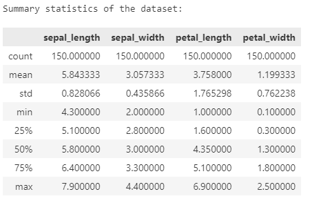
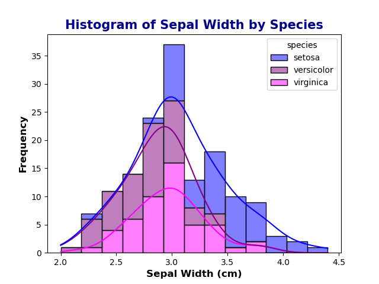
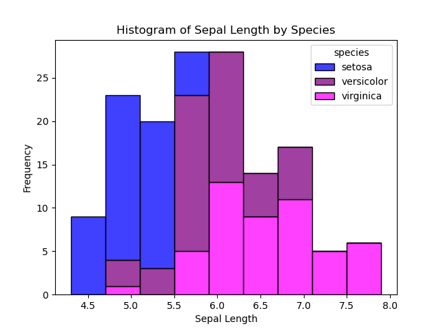
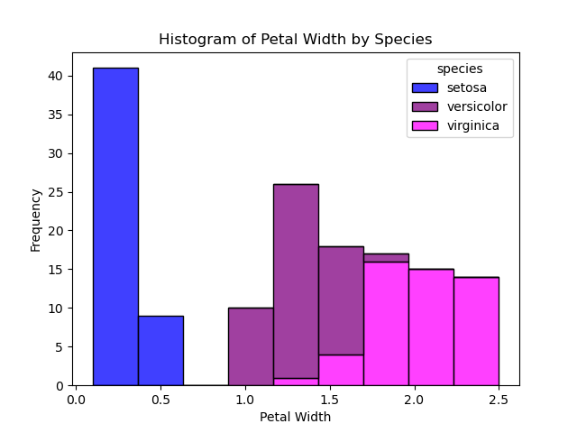
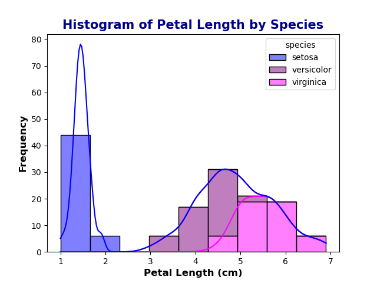
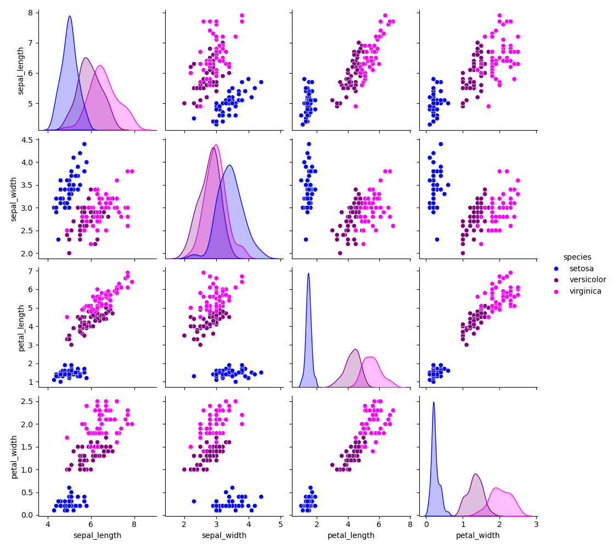

### Higher Diploma in Science: Computing-Data Analytics 2024
### Module: Programming and Scripting

<b>

# 
Analysis of the Iris Dataset
</b>

***

The Iris dataset consists of 150 samples of three species of Iris flowers. 50 samples from Iris Setosa, Iris Versicolor and Iris Virginica. The length and width of the sepals and petals of each flower was measured. 

# About the dataset:
***

# Summary Statistics:
***

The describe() function in pandas generates descriptive statistics of the dataFrame giving a summary of the central tendency, dispersion and shape of the distribution of the dataset. 

Sepal Length: 
-   The mean 5.84cm and median 5.80cm are close indicating a symmetric distribution
-   the standard deviation of 0.83 indicates low variability. 

Sepal Width:
-   the mean 3.06cm and median 3.00cm are close indicating symmetric distribution, with an even lower standard deviation of 0.44 showing low variability. 

Petal Length:
-   The mean of 3.76cm is significantly lower than the median of 4.35cm indicating a left skewed distribution. 
-   A higher standard deviation of 1.76 indicates a higher variability among the data points. 

Petal Width: 
-   The mean of 1.2cm is slightly lower than the median of 1.3cm which could indicate a slightly left skew. 
-   A standard deviation of 0.76 is low

# Data Visualisation:
***
Histograms show the distribution of numerical data by grouping data points that lie within a range of values in to a bin. The higher the bar the greater the frequency of values.

From the above histograms it can be seen that there is overlap between all species for sepal width and sepal length. 

Iris setosa is clearly distinguishable from Iris Versicolor and Iris Virginica in petal width and petal length with Iris setosa having the smaller petal lengths and widths and is seen to be clustered at the lower end of the histogram. There is overlap seen between Iris Virginica and Iris Versicolor. 

The higher standard deviation obtained for petal length is more than likely due to the significant difference between the species in petal length. Iris setosa has a mean petal length of 1.46cm in comparison to Iris Versicolor with a mean of 4.26cm and Iris Virginica with a mean of 5.55cm. 

While petal width had a lower standard deviation than petal length it can be seen that Iris Setosa forms a distinct cluster at the lower end of the histogram separate from Iris Versicolor and Iris Virginica. The mean petal width of Iris Setosa of 0.25cm is significantly lower than that of Iris Versicolor with a mean of 1.33cm and Iris Virginica with a mean of 2.03cm. 

#### Correlation:

