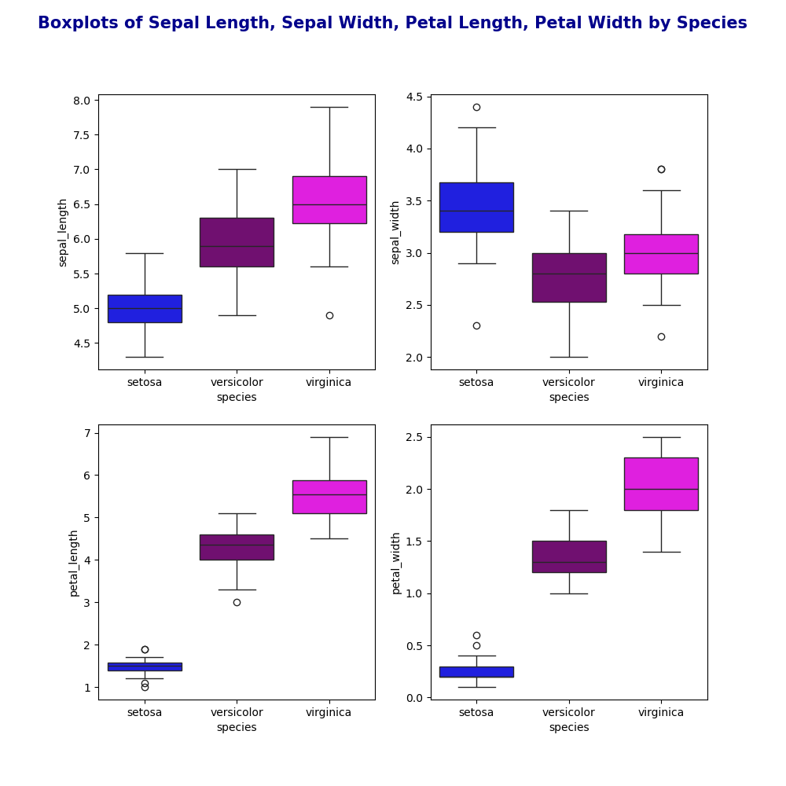
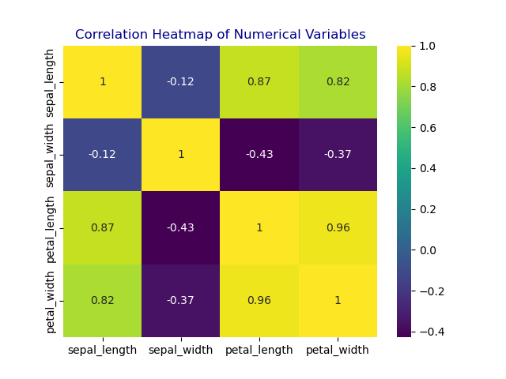
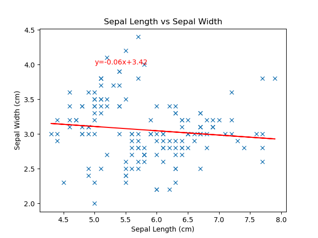
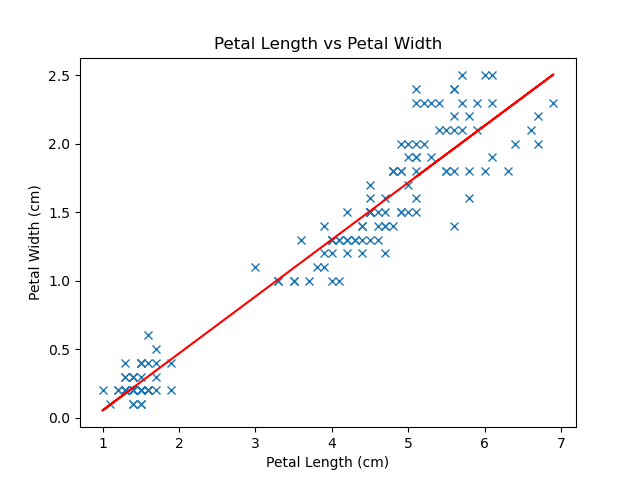

### Higher Diploma in Science: Computing-Data Analytics 2024
### Module: Programming and Scripting
*** 

<b>

# 
Analysis of the Iris Dataset
</b>

***

## Objective: 

The objective of this project is to analyse the Fishers Iris dataset using Python with Visual Studio Code. 
 Python libraries such as Pandas, Numpy, Matplotlib, Seaborn are used to explore the data, generate descriptive statistics and create data visualisations to demonstrate trends and relationships within the dataset. 

***
## Background:

The Iris dataset is a multivariate dataset consisting of 50 samples from three species of the Iris flower. Iris Setosa, Iris Versicolor and Iris Virginica. The dataset contains length and width measurements of the sepals and petals of the flowers. The dataset was first used by Ronald A. Fisher in 1936 to demonstrate how linear discriminant analysis can be applied to classify data in different categories (species) based on the measurements of the flower features. Fisher is said to have created the foundations for modern statistical science. 

***
## Method:

###    1. Import libraries:

[Pandas]('https://pandas.pydata.org/docs/user_guide/10min.html') is a python library for data manipulation and analysis built on top of Numpy.It is used for the dataFrame datastructure. 
A dataframe is a 2D labelled data structure with columns of different data types, similar to a spreadsheet where each column represents a variable and each row represents an observation.

[Numpy]('https://numpy.org/doc/stable/user/whatisnumpy.html') is a powerful library for the numerical computing of Python.

[Matplotlib]('https://www.w3schools.com/python/matplotlib_intro.asp') is a graph plotting library in Python.

[Seaborn]('https://www.w3schools.com/python/numpy/numpy_random_seaborn.asp') is a library that uses Matplotlb underneath to plot graphs. 

###    2. Load the dataset:

The [Iris dataset]('https://raw.githubusercontent.com/mwaskom/seaborn-data/master/iris.csv') was loaded from the .csv file obtained from the seaborn github repository into a dataFrame using Pandas. 

###    3. Examining the dataset:

After loading the dataset, the structure and content of the data set was analysed by various steps. The first and last 5 rows were displayed to get an idea of what the data looks like and the information that it contains. The shape of the data set was looked at. This includes the number of rows and columns of the data to see the size of the dataset. The Iris dataset has 150 rows and 5 columns. Each row represents an observation of a flower each columns representing a variable. The first four columns are of type float64 which represents continuous numerical measurements such as petal and sepal lengths and widths, while the species column is of type int64 representing categorical data. The value counts of the target variable of species was looked at to check how many samples of each class of species was present. There was an equal number of 50 samples for each of the species showing that the dataset is balanced.   
The dataset was checked for missing values using df.isnull(). There was no missing values within the dataset. 
The summary of the dataset was sent to a text file. 

### 5. Summary Statistics:
***

The describe() function in pandas generates descriptive statistics of the dataFrame giving a summary of the central tendency, dispersion and shape of the distribution of the dataset. 

Sepal Length: 
-   The mean 5.84cm and median 5.80cm are close indicating a symmetric distribution
-   the standard deviation of 0.83 indicates low variability. 

Sepal Width:
-   the mean 3.06cm and median 3.00cm are close indicating symmetric distribution, with an even lower standard deviation of 0.44 showing low variability. 

Petal Length:
-   The mean of 3.76cm is significantly lower than the median of 4.35cm indicating a left skewed distribution. 
-   A higher standard deviation of 1.76 indicates a higher variability among the data points. 

Petal Width: 
-   The mean of 1.2cm is slightly lower than the median of 1.3cm which could indicate a slightly left skew. 
-   A standard deviation of 0.76 is low

### 6. Data Visualisation:
***
[Histograms]('https://www.w3schools.com/statistics/statistics_histograms.php') show the distribution of numerical data by grouping data points that lie within a range of values in to a bin. The higher the bar the greater the frequency of values.

Observations:

From the above histograms it can be seen that there is overlap between all species for sepal width and sepal length. 

Iris setosa is clearly distinguishable from Iris Versicolor and Iris Virginica in petal width and petal length with Iris setosa having the smaller petal lengths and widths and is seen to be clustered at the lower end of the histogram. There is overlap seen between Iris Virginica and Iris Versicolor. 

The higher standard deviation obtained for petal length is more than likely due to the significant difference between the species in petal length. Iris setosa has a mean petal length of 1.46cm in comparison to Iris Versicolor with a mean of 4.26cm and Iris Virginica with a mean of 5.55cm. 

While petal width had a lower standard deviation than petal length it can be seen that Iris Setosa forms a distinct cluster at the lower end of the histogram separate from Iris Versicolor and Iris Virginica. The mean petal width of Iris Setosa of 0.25cm is significantly lower than that of Iris Versicolor with a mean of 1.33cm and Iris Virginica with a mean of 2.03cm. 

***

[Boxplots]('https://www.w3schools.com/statistics/statistics_box_plots.php') show the distribution of data by displaying the minimum and maximum value, the first Quartile (25%: the lower part of the box), third quartile (75%: the upper area of the box), the median (50%: represented by a line inside the box). Boxplots give a visual summary of the data distribution and the presence of skewness/outliers. 

Observations:

***

A [Pairplot]('https://www.geeksforgeeks.org/python-seaborn-pairplot-method/') is used to see if there is any relationships between two variables. 
The plots are in a scatterplot matrix format where the row name represents the x-axis and column name represents the y-axis. The main diagonal subplots are the histogram distributions for each variable. 

Observations:

***

A [Heatmap]('https://seaborn.pydata.org/generated/seaborn.heatmap.html') is used to visualise correlations between variables. 

Observations: 

[Correlation](https://en.wikipedia.org/wiki/Pearson_correlation_coefficient) coefficients indicate the strength and direction of the linear relationship between the variables. Positive correlation indicates that as one variable increases the other variable tends to increase also. 
A correlation of 0.96 is seen for petal length vs petal width. This is a strong positive correlation that is close to 1 between the variables. This means that as petal length increases petal width increases also. 

***

