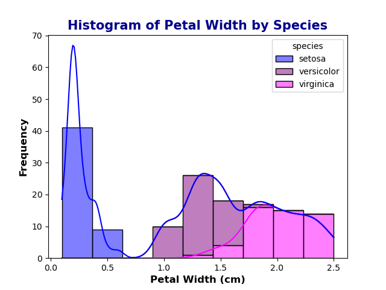

#### Higher Diploma in Science: Computing-Data Analytics 2024
#### Module: Programming and Scripting

<b>

# 
Analysis of the Iris Dataset
</b>

***

The Iris dataset consists of 150 samples of three species of Iris flowers. 50 samples from Iris Setosa, Iris Versicolor and Iris Virginica. The length and width of the sepals and petals of each flower was measured. 

# About the dataset:
***

# Summary Statistics:
***

The describe() function in pandas generates descriptive statistics of the dataFrame giving a summary of the central tendency, dispersion and shape of the distribution of the dataset. 

Observations: 
-   

# Data Visualisation:
***

