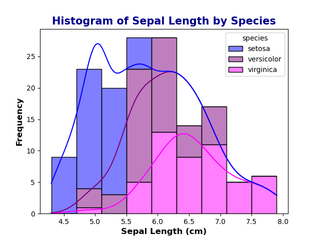
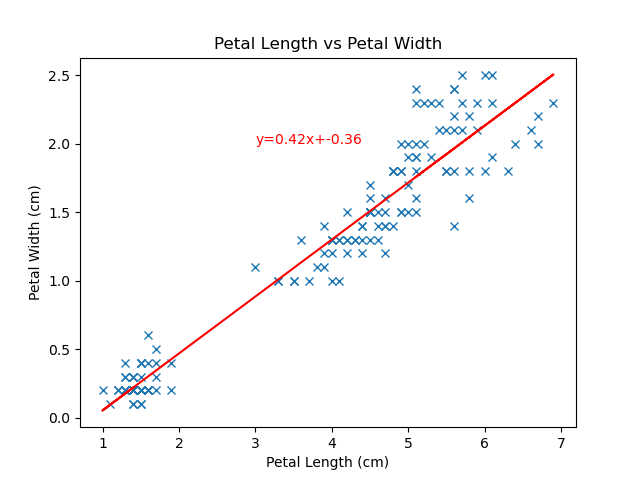

### Higher Diploma in Science: Computing-Data Analytics 2024
### Module: Programming and Scripting
*** 

<b>

# 
Analysis of the Iris Dataset
</b>

***

## Objective: 

The objective of this project is to analyse the Fishers Iris dataset using Python with Visual Studio Code. 
 Python libraries such as Pandas, Numpy, Matplotlib, Seaborn are used to explore the data, generate descriptive statistics and create data visualisations to demonstrate trends and relationships within the dataset. 

***
## Background:

The Iris dataset is a multivariate dataset consisting of 50 samples from three species of the Iris flower. Iris Setosa, Iris Versicolor and Iris Virginica. The dataset contains length and width measurements of the sepals and petals of the flowers. The dataset was first used by Ronald A. Fisher in 1936 to demonstrate how linear discriminant analysis can be applied to classify data in different categories (species) based on the measurements of the flower features. Fisher is said to have created the foundations for modern statistical science. 

***
## Method:

###    1. Import libraries:

[Pandas](https://pandas.pydata.org/docs/user_guide/10min.html) is a python library for data manipulation and analysis built on top of Numpy.It is used for the dataFrame datastructure. 
A dataframe is a 2D labelled data structure with columns of different data types, similar to a spreadsheet where each column represents a variable and each row represents an observation.

[Numpy](https://numpy.org/doc/stable/user/whatisnumpy.html) is a powerful library for the numerical computing of Python.

[Matplotlib](https://www.w3schools.com/python/matplotlib_intro.asp) is a graph plotting library in Python.

[Seaborn](https://www.w3schools.com/python/numpy/numpy_random_seaborn.asp) is a library that uses Matplotlb underneath to plot graphs. 

###    2. Load the dataset:

The [Iris dataset](https://raw.githubusercontent.com/mwaskom/seaborn-data/master/iris.csv) was loaded from the .csv file obtained from the seaborn github repository into a dataFrame using Pandas. 

###    3. Examining the dataset:

After loading the dataset, the structure and content of the data set was analysed by various steps. The first and last 5 rows were displayed to get an idea of what the data looks like and the information that it contains. The shape of the data set was looked at. This includes the number of rows and columns of the data to see the size of the dataset. The Iris dataset has 150 rows and 5 columns. Each row represents an observation of a flower, each column representing a variable. The first four columns are of type float64 which represents continuous numerical measurements such as petal and sepal lengths and widths, while the species column is of type object representing categorical data. All columns have 150 non null values indicating no missing values. The dataset was also checked using df.isnull(). There was no missing values in the dataset. The value counts of the target variable of species was looked at to check how many samples of each class of species was present. There was an equal number of 50 samples for each of the species showing that the dataset is balanced.   
The summary of the dataset was sent to a text file. Refer to summary_irisdata.txt for more information. 

### 4. Summary Statistics:
***
The [describe()](https://pandas.pydata.org/pandas-docs/version/0.20.2/generated/pandas.DataFrame.describe.html) function in pandas generates descriptive statistics of the dataFrame giving a summary of the central tendency, dispersion and shape of the distribution of the dataset. 

 The table above gives a summary of the main statistics for each numerical variable. The count is the number of observations of flowers. There is 150 flowers in the dataset. The mean is the average value, the standard deviation is a measure of the amount of variation of the data points from the mean. 25%, 50%(median), 75% percentiles gives an overview of the data distribution. 

**Main observations:**

For petal length the mean of 3.76 cm is significantly lower than the median of 4.35cm, indicating there may be a left skewed distribution. The mean and median are equal in value in a perfectly symmetrical distribution. The mean being less than the median indicates that there are smaller values skewing the data or potential outliers pulling the mean down.  Petal length has the highest standard deviation of 1.76 indicating a higher variability among the data points. 
The mean of petal width is 1.2cm which is slightly lower than the median of 1.3cm which although close to the median it may indicate a slightly left skew. The standard deviation is lower than petal length indicating less variability among the data points than for petal length. For sepal length and sepal width the mean and medians are close indicating a more symmetric distribution, suggesting that the data points for sepal width are more evenly distributed around the mean. 

### 5. Data Visualisation:
***

[Histograms](https://www.w3schools.com/statistics/statistics_histograms.php) show the distribution of numerical data by grouping data points that lie within a range of values in to a bin. The higher the bar the greater the frequency of values.

**Main Observations:**

**Sepal measurements:**

From the above histograms, It can be seen that there is overlap between all species for sepal width and sepal length, However, Iris setosa is seen to have the largest sepal width and smallest sepal length. Iris Virginica and Iris Versicolor have more overlapping sepal widths and lengths as seen also in the range values seen below. 

_Sepal length:_

-   Iris Setosa range: 4.30cm-5.8cm

-   Iris Versicolor range: 4.90cm-7.00cm

-   Iris Virginica range: 4.90cm -7.90cm

_Sepal width:_

-   Iris Setosa range: 2.30cm-4.4cm

-   Iris Versicolor range: 2.00cm -3.4cm

-   Iris Virginica range: 2.2cm-3.8cm

**Petal measurements:**

Iris Setosa is clearly distinguishable from Iris Versicolor and Iris Virginica in petal width and petal length with Iris setosa having significantly smaller petal lengths and widths and is seen to be clustered at the lower end of the histogram. There is overlap seen between Iris Virginica and Iris Versicolor in both petal lengths and widths. 
The higher standard deviation obtained for petal length is more than likely due to the significant difference between the species in petal length. Iris setosa has a mean petal length of 1.46cm in comparison to Iris Versicolor with a mean of 4.26cm and Iris Virginica with a mean of 5.55cm. 
While petal width had less skewedness and a lower standard deviation than petal length it can be seen that Iris Setosa forms a distinct cluster at the lower end of the histogram separate from Iris Versicolor and Iris Virginica. The mean petal width of Iris Setosa of 0.25cm is significantly lower than that of Iris Versicolor with a mean of 1.33cm and Iris Virginica with a mean of 2.03cm.

***

[Boxplots](https://www.w3schools.com/statistics/statistics_box_plots.php) show the distribution of data by displaying the minimum and maximum value, the first Quartile (25%: the lower part of the box), third quartile (75%: the upper area of the box), the median (50%: represented by a line inside the box). Boxplots give a visual summary of the data distribution and the presence of skewness/outliers. Outliers can be identified using boxplots or calculations using the Inter-quartile range.

**Main Observations:**
The boxplots show that Iris Setosa has the lowest measurements for sepal length, petal length and petal width and the highest measurement for sepal width. Overlapping is seen between all species in sepal length and width with more overlapping observed for Iris Virginica and Iris Versicolor. Iris Setosa is significantly separated from the other two species in both petal length and petal width, with Iris Virginica and Iris Versicolor showing overlap.
From the boxplots, outliers can be seen across certain species and features with Iris Setosa having a higher amount of outliers for petal width and length than Iris Versicolor and Iris Virginica. While the separation between Iris Setosa and the other variables appears to be large, its still important to deal with outliers to ensure the integrity of the data. Due to the large separation observed, outliers might not significantly affect the overall separation but could impact specific analysis or models. For the purposes of this study, outliers are not removed as the objective of the study to visualise the data for any trends or relationships is still met. 

***

A [Pairplot](https://www.geeksforgeeks.org/python-seaborn-pairplot-method/) is used to see if there is any relationships between two variables. 
The plots are in a scatterplot matrix grid format where the row name represents the x-axis and column name represents the y-axis. The main diagonal subplots are the histogram distributions for each variable. 

**Main observations:**

There is a clear separation for Iris Setosa in both petal and sepal measurements with Iris Setosa forming distinct clusters, therefore the data is said to be linearly separable. Iris Setosa is easily distinguishable from Iris Versicolor and Iris Virginica which show overlap especially in sepal measurements. They show more separation in petal measurements. 
There appears to be a positive linear relationship between petal width and petal length as the data points cluster around a straight line that slopes upwards from left to right, showing a consistent relationship between the two variables. From the heatmap below the correlation coefficient is 0.96 which indicates a very strong positive linear relationship between the variables. 

***

A [Heatmap](https://seaborn.pydata.org/generated/seaborn.heatmap.html) is used to visualise correlations between variables. 
[Correlation](https://en.wikipedia.org/wiki/Pearson_correlation_coefficient) coefficients indicate the strength and direction of the linear relationship between the variables. Positive correlation indicates that as one variable increases the other variable tends to increase also. 

A correlation of 0.96 is seen for petal length vs petal width. This is a near perfect positive correlation that is close to 1 between the variables. The closer a value is to 1 the higher the correlation. This means that as petal length increases petal width increases also. These features are very closely related, by knowing the petal length it would allow you to predict the petal width with a high degree of accuracy. 
In addition, there is a very strong positive correlation between sepal length and petal length at 0.87 which indicates that as the sepal length increases the petal length also tends to increase. Although the relationship is not as strong as between petal length and petal width there is a significant linear relationship between the variables. 
There is also a strong positive correlation between sepal length and petal width at 0.82 which suggests that there is a significant linear relationship between sepal length and petal width. 
For sepal length and sepal width there is a correlation of -0.37 which suggests a weak negative relationship suggesting that these features are not strongly associated. 
***

[Scatterplots](https://en.wikipedia.org/wiki/Scatter_plot) are used to identify correlations between two variables.

**Petal Length vs Petal Width:**

 The plot shows a cluster on the bottom right which is likely to be Iris Setosa based on the earlier analysis of the data. Iris Setosa was shown to have smaller petal lengths and petal widths. A scatterplot separated based on species would help to confirm this. The other data points appear more clustered together indicating that they are likely Iris Versicolor and Iris Virginica. The line goes directly through all the data points from left to right showing a clear linear relationship and strong positive correlation between petal length and petal width across all species. The strong positive correlation of 0.96 confirms this. The slope of the line is 0.42 which means that for every 1cm increase in petal length the petal width increases by approximately 0.42cm. 

**Petal Length vs Petal Width per species:**

 

When separated based on species, the blue cluster at the bottom right is confirmed to be Iris Setosa, due to Iris Setosa having smaller petal lengths and widths. The distinct separation is consistent with earlier observations of Iris Setosa. The pink and purple clusters overlap slightly for Iris Virginica and Iris Versicolor indicating that these species have more similar petal measurements. This overlap can make it more difficult to distinguish between them based on petal measurements alone. 

**Sepal Length vs Sepal Width:**

The scatterplot for sepal length vs sepal width shows a negative linear relationship between the two variables. The data points are more dispersed in comparison to the scatterplot for petal length vs petal width. The correlation coefficient of -0.37 confirms this. Due to the dspersion of the data points it is difficult to determine the species. The negative slope of -0.06 further shows the weak relationship. The changes in sepal width relative to sepal length is minimal. Therefore sepal length is not a strong predictor of sepal width in the dataset. 

**Sepal Length vs Sepal Width per species:**

When separated based on species, the relationships between sepal length and width appear to have a positive linear relationship with an upwards facing line.  While the overall dataset shows a weak negative correlation, the individual species have stronger positive relationships. The datapoints are however more dispersed from the line than seen in petal length vs petal width. Also, there is significant overlap between the Iris Virginica and Iris Setosa in comparison to petal length vs petal width, while there is still overlap they are more separated in petal length vs petal width. While there is overlap of sepal lengths, Iris setosa is distinguishable from Iris Virginica and Iris Versicolor due to having larger sepal widths, however the separation is not as significant as in petal length vs petal width. 
***

### Conclusion:

The analysis shows that Iris Setosa is linearly separable from Iris Versicolor and Iris Virginica with no overlap observed in its petal length and petal width. This clear separation makes it easily distinguishable from Iris Versicolor and Iris Virginica which show more overlap. Iris Setosa also appears to have less overlap in sepal measurements than Iris Virginica and Iris Versicolor which contributes to its separation from the other species.  
The high correlation of 0.96 for petal length vs petal width indicates a near perfect linear relationship between these features which suggests that they are closely related and changes in petal length would indicate changes in petal width. The strong linear relationship between these features suggest they could be used in predictive models. In addition, sepal length shows strong correlations with both petal length and petal width suggesting that predictive models using these features may be effective. 

***

### End

#### References:

https://pandas.pydata.org/docs/reference/api/pandas.DataFrame.html

https://seaborn.pydata.org/

https://www.datacamp.com/cheat-sheet/matplotlib-cheat-sheet-plotting-in-python

https://www.kodeclik.com/how-to-bold-text-in-python/

https://www.tutorialspoint.com/how-to-put-text-outside-python-plots

https://www.geeksforgeeks.org/writing-to-file-in-python/

https://en.wikipedia.org/wiki/Iris_flower_data_set

https://www.datacamp.com/cheat-sheet/matplotlib-cheat-sheet-plotting-in-python

http://www.lac.inpe.br/~rafael.santos/Docs/CAP394/WholeStory-Iris.html

https://www.geeksforgeeks.org/python-basics-of-pandas-using-iris-dataset/
